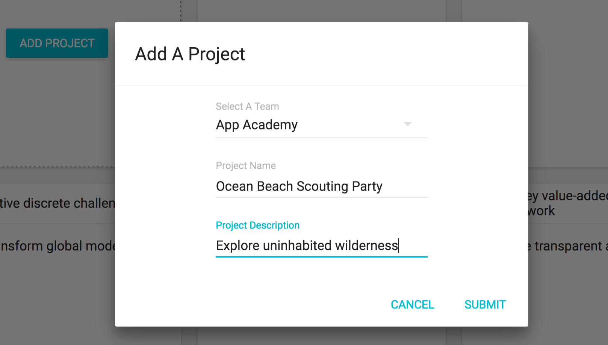
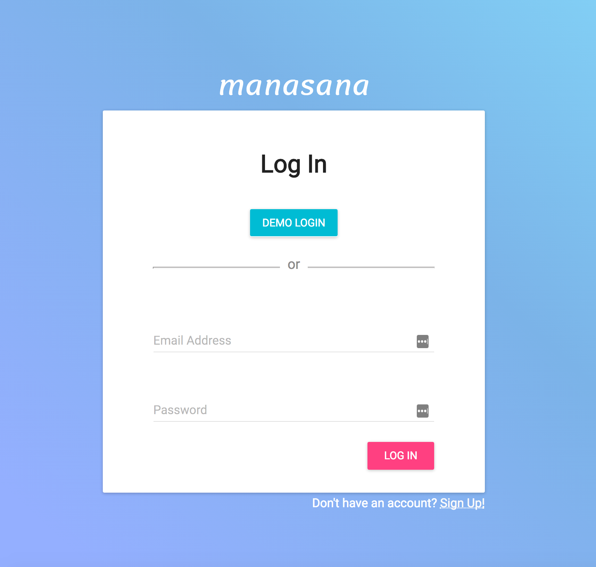
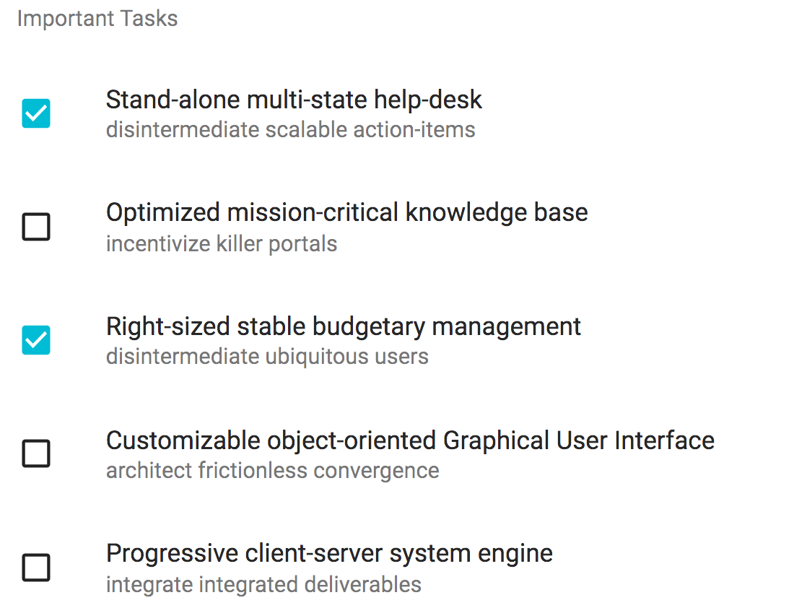

# Manasana

[Manasana](https://manasana.herokuapp.com) is a clone of the project management app [Asana](https://app.asana.com/). Manasana allows for team members to collaboratively track project and task completion.

Manasana was a personal project built by Matt Kerchner.

Manasana home page: https://manasana.herokuapp.com

## Features

- User accounts with secure authentication
- Project Dashboard allowing easy management of your teams' projects
- Ability to view tasks assigned or authored by you
- Ability to create and edit tasks by project

## Project Design

Manasana was a 9 day project during January of 2017. You can view the original design timeline and proposal [here](./docs/README.md)

[Wireframes](./wireframes/) were designed to show basic user interaction and the structure of the site.

From there, a rough [Component Hierarchy](./component-hierarchy.md), [Databse Schema](./schema.md) and [Sample State](./sample-state.md) were planned out.

## Screenshots

## Technology

Manasana is a single-page application built on Rails and React.js, adhering to Material design guidelines using the [material-ui](www.material-ui.com) library.

## Future Implementations

Manasana is a very barebones application with multiple planned features for future implementation.

### Some Planned Features

- [ ] Comments and Due Dates for Tasks
- [ ] Calendar showing upcoming Task and Project deadlines
- [ ] Chart showing Task completion by Team or Project
